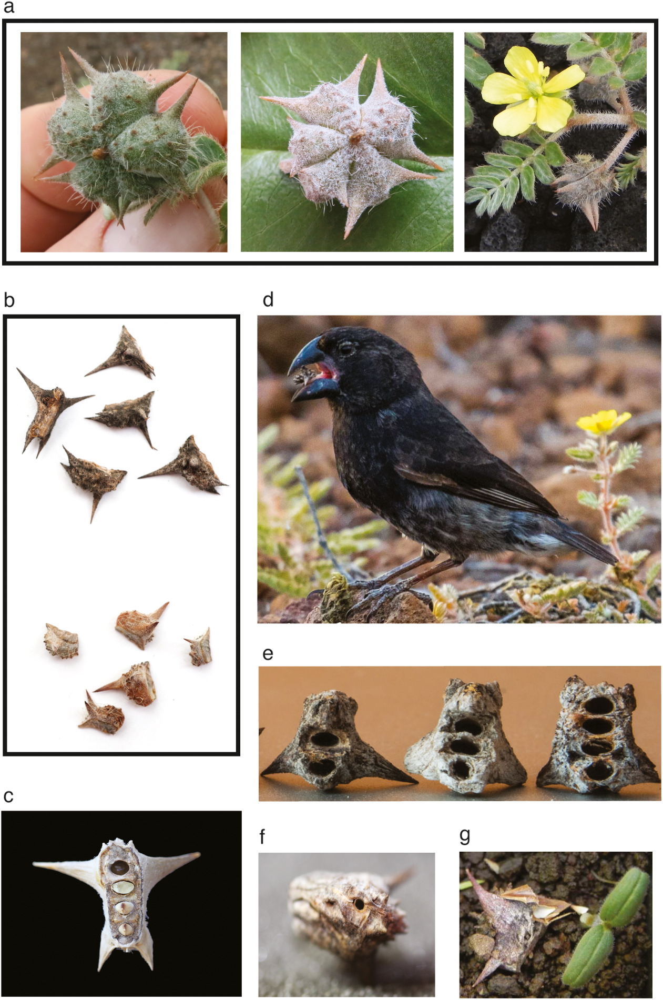

```{r setup, include=FALSE, message=FALSE}
knitr::opts_chunk$set(echo = FALSE)
library(flextable)    # I've recently learned that flextables are more easily
library(ftExtra)      # exported to Word, so we'll use these packages too.
library(gt)           # Grammar of Tables -- a bunch of bells and whistles 
library(gtsummary)    # Uses gt to automatically produce summary tables
library(cowplot)      # Claus Wilke's package to produce mult-panel figures
library(latex2exp)    # Allows you to use LaTeX math in ggplot2 figures
library(tidyverse)    # A "meta-package" that includes many useful packages

# r_refs from the papaja package can generate a bibliography file of loaded
# packages

papaja::r_refs(file = "r-GAE1.bib")

SE <- function(x) sd(x)/sqrt(length(x))

```

## Scenario: Does fruit morphology of *Tribulus cistoides* differ among populations on Galápagos Islands with or without the large-beaked finch, *Geospiza magnirostris*?

@Carvajal-Endara2020 wanted to examine whether Darwin's finches may be a force of selection on the morphology of the seeds on which they feed. Character displacement in beak morphology among these finches in response to competition for seed resources is often used as an example of evolution by natural selection, but there are very few studies that have focused on the potential effect of selective predation on the seed resources.

Seeds of the Jamaican feverplant, *Tribulus cistoides*, are an important food resource during dry months for the three larger ground finch species (i.e. *Geospiza fortis*, *G. magnirostris*, and *G. conirostris*) in the Galápagos Islands. The researchers collected data to ask whether the intensity of seed predation and the strength of natural selection by finches on fruit defense traits vary with varying finch community composition (i.e., the presence/absence of the largest beaked species, which feed on T. cistoides most easily).

From @Carvajal-Endara2020: "*Tribulus cistoides* plants can flower at any time of year on the Galápagos Islands, but most of its vegetative growth occurs during the wet season (from January to May), they produce fruits called schizocarps (Figure \@ref(fig:Figure1)a), which contain five individual segments referred to as mericarps that typically separate from one another as the fruit dries (Figure \@ref(fig:Figure1)b). Each *T. cistoides* mericarp is a hard fibrous structure that includes from one to seven seeds contained within individual compartments (Figure \@ref(fig:Figure1)c). Mericarps typically have four spines (two upper and two lower sharp protuberances), but the size and position of spines varies greatly among individual plants, and some mericarps completely lack some or all spines."

```{r Figure1, out.width="30%", fig.cap="(a) Tribulus cistoides fruits (schizocarps), from left to right: a green immature fruit, a mature dry fruit, and a fruit attached to a maternal plant. (b) Two sets of dry mericarps, corresponding to two fruits of different plants, showing variation in size and number of spines. Mericarps in the upper set are larger and have four spines while mericarps in the lower set are smaller and have only two spines. (c) Opened mericarp to expose seed compartments, one empty compartment and three compartments with seeds inside. (d) *Geospiza fortis* (Medium Ground Finch) holding a *T. cistoides* mericarp. Mericarps showing marks observed (e) when seeds are eaten by finches, (f) when seeds are eaten by insects, and (g) when seeds germinate. Photo credits: Marc T. J. Johnson (a [left and middle], c, and f), Andrew P. Hendry (b), Kiyoko M. Gotanda (d and e), and Sofía Carvajal‐Endara (a [right] and g)."}



```

### Your assignment:

Choose and conduct appropriate tests using *Condensed.df* *(built in the dataImport code chunk)* to decide whether mean mericarp size and proportion of mericarps with lower spines differs depending on whether *Geospiza magnirostris* is present on the island or not. You may add your results and conclusions in the "Results" section. I expect to see a nice figure summarizing the information I've provided for you (Table \@ref(tab:Table2)).

## Methods

@Carvajal-Endara2020 sampled *T. cistoides* populations annually from 2015 to 2017 on the four islands. Populations were considered to be discrete patches of plants separated by at least 500 m from other such patches. Sampling consisted of haphazardly (they made an effort to collect "blindly" to avoid bias) collecting approximately 100 mericarps from each population in each year. Differing numbers of populations were sampled on each island and among different years (Table \@ref(tab:Table1)).

They used digital calipers to measure mericarp length (mm) and width (mm), and noted the presence or absence of lower spines. These data and other measures were made available on the [Dryad Digital Repository](https://datadryad.org/) [@Carvajal-Endara2020Data], and provided as part of this GAE R-project as *Tribulus_cistoides_full.csv*. @Carvajal-Endara2020 analyzed these data using linear mixed-effect modeling, a technique you will learn during the last half of this biostatistics course that allowed them to not only test for a differences associated with the presence or absence of *G. magnirostris* but also for differences among populations and for differences among islands and years.

For this GAE, I have treated populations as the experimental unit and assumed independence among populations on the same island and measured in different years. I approximated mericarp volume by assuming them to be roughly cylindrical, thus:

$$mericarp~size = L \times \pi\left(\frac{W}{2}\right)^2 .$$

After estimating mericarp size as a volume, I calculated the mean mericarp size for each population (Table \@ref(tab:Table2)) and the proportion of mericarps collected with lower spines from each population.

### Statistical Methods.

All analyses were computed in R [@R-base] accessed via RStudio [@RStudio]. Data import, manipulation, and visualization were done using packages included in the tidyverse metapackage [@R-tidyverse]. Tables were prepared using the gt, gtsummary, flextable, and ftExtra packages [@R-gt; @R-gtsummary; @R-flextable; and @R-ftExtra].

```{r dataImport, message=FALSE}
df1 <- read_csv("Tribulus_cistoides_full.csv")

df1 <- df1 %>%
  mutate(mericarp.size = Mericarp.length * (Mericarp.width/2)^2 * pi)

df1 <- df1[df1$Island != "Espanola",]
df1 <- df1[df1$Island != "Baltra",]
df1 <- df1[df1$Island != "Seymour.Norte",]

df1$Island <- factor(df1$Island)

Condensed.df <- df1 %>%
  group_by(Year, Island, Population) %>%
  summarize(mean.mericarp.size = mean(mericarp.size),
            prop.with.lower.spines = sum(Presence.of.lower.spines)/n()) %>%
  mutate(G.magnirostris = factor(ifelse(
              Island == "Isabella" | 
              Island == "Santa.Cruz", "Present", "Absent")))
```

```{r Table1}
Table1 <- tbl_cross(Condensed.df, row = Island, col = Year) %>%
  modify_caption(caption = "Number of populations sampled each year on each
                 island.") %>%
  modify_header(update = list(label ~ "")) %>%

  as_flex_table()

Table1
```

## Results:

Mericarp size tended to be slightly smaller $(\approx 7 mm^3)$ from populations where *G. magnirostris* was present (Table \@ref(tab:Table2)). [*\<you will need to provide a test of these results\>*]{.ul}. Similarly, the proportion of mericarps with lower spines was [*\<signficantly? for you to decide\>*]{.ul} greater when *G. magnirostris* was present.

[Futher results should go here.]{.ul}

```{r Table2}
Table2 <- Condensed.df %>%
  group_by(G.magnirostris) %>%
  select(G.magnirostris, mean.mericarp.size, prop.with.lower.spines) %>%
  tbl_summary(by = "G.magnirostris",
              statistic = list(all_continuous() ~ "{mean} ({SE})"),
              missing = "no",
              digits = list(mean.mericarp.size ~ c(2,2),
                            prop.with.lower.spines ~ c(3,3)),
              label = list(
                mean.mericarp.size ~ "Index of mericarp size",
                prop.with.lower.spines ~ 
                  "Proportion of mericarps with lower spines")) %>%
  modify_caption(caption = "Mericarp size (volume $\\approx L \\times \\pi 
                 (W/2)^2$) and proportion of mericarps with lower spines using 
                 samples from different populations and years collected from 
                 islands with and without *G. magnirostris*.") %>%
  modify_header(update = list(label ~ "Variable")) %>%
  modify_spanning_header(all_stat_cols() ~ "**G. magnirostris**")

as_flex_table(Table2) %>%
  colformat_md() %>%
  bold(bold = TRUE, part = "header") %>%
  italic(italic = TRUE, part = "header")
```

# References:
